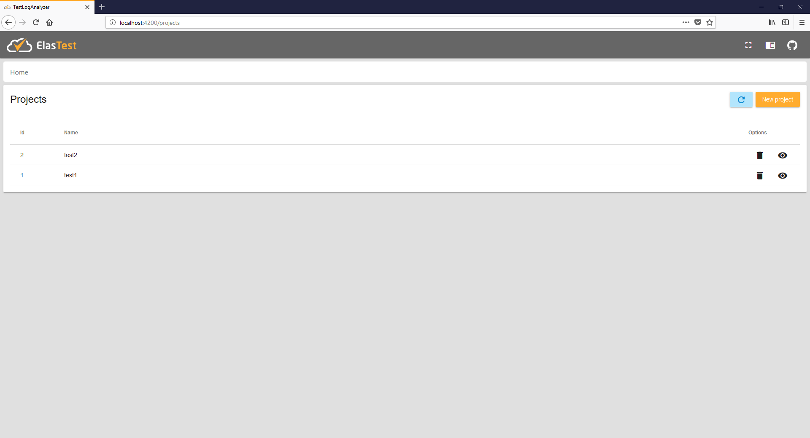
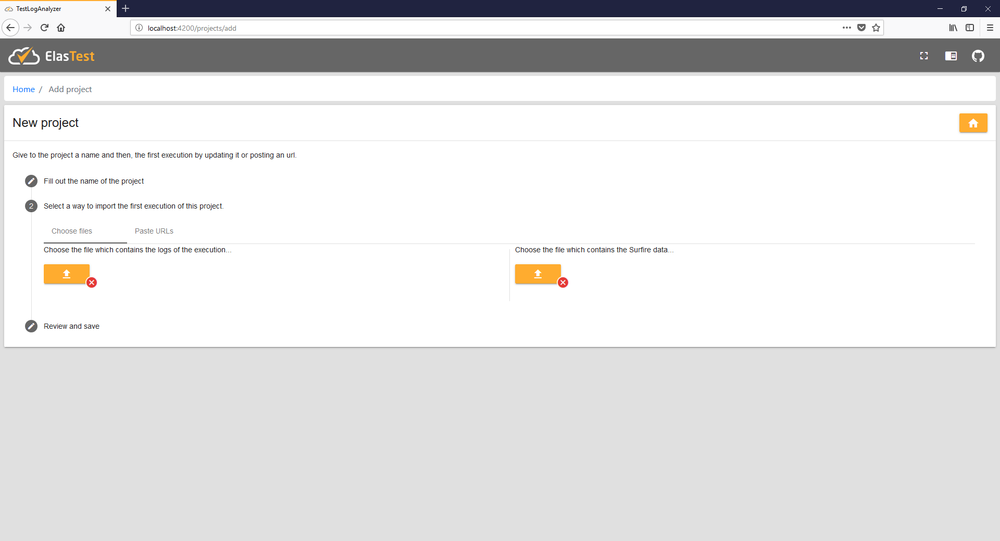
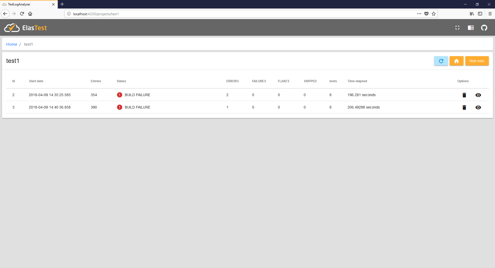
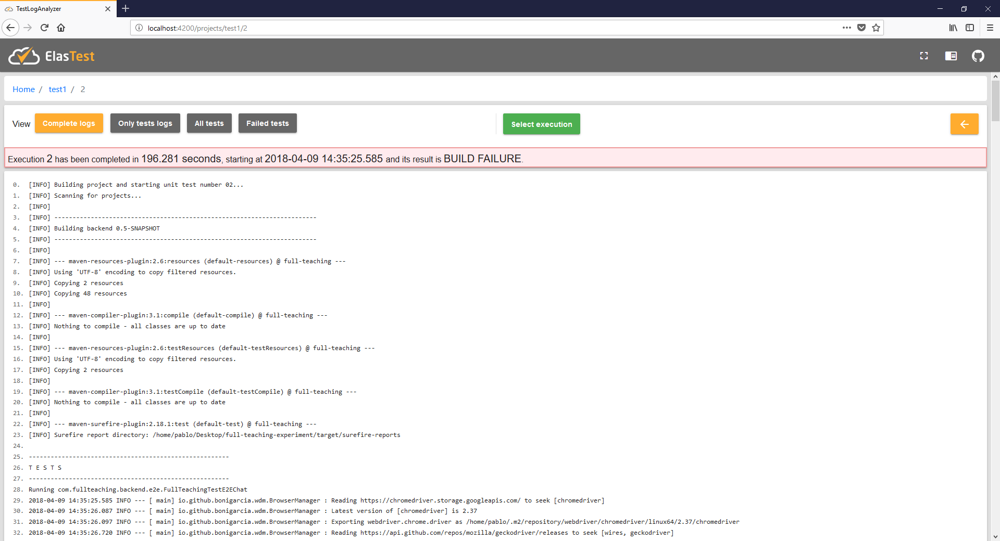
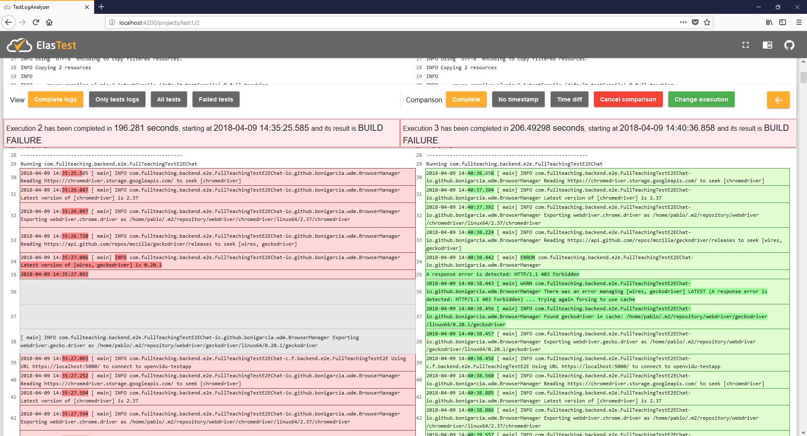

# TestLogAnalyzer - Front end

## About this front end
This front end has been developed in Angular 5 and, as a Angular CLI Project, you can easily make it works just downloading it and then opening the cmd and executing `ng serve`.

The app will be served at port 4200.

## Content of the pages
### Projects
#### Home
All projects created are displayed. You can access to the executions of a concrete project or delete it. If you delete a project, all its executions will be deleted too.

#### Create project
A new project can be created and the user must provide at least one execution (.txt file and its surefire report as .xml file).

### Execution of project
#### Home
For a target project, this page displays all its executions.

### Logs of execution
#### Home (simple visualization)
The user just has to select a view mode

#### Comparison mode
When the user selects an execution to compare with and select a comparison mode, the layout changes.

